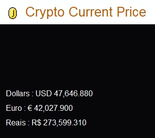

# CryptoAnalyses  

  

> Track the price of Bitcoin and Ethereum in real time directly on your desktop  

### Adjustments and improvements  

The project is still under development and future updates will focus on the following tasks:  

- [x] Create Frames
- [x] Front end Etructure
- [x] Add Bitcoin Frames and API
- [ ] Add Ethereum Frames and API  
- [x] import API
- [x] Running program
- [ ] Class Division  

## 💻 Prerequisites  

Before starting, make sure you meet the following requirements:  
<!---Estes são apenas requisitos de exemplo. Adicionar, duplicar ou remover conforme necessário--->
* You have installed the latest version of Python `<linguagem / dependência / requeridos>`
* Do you have a Windows machine `<Windows / Linux / Mac>`.

## 🚀 Install <CryptoAnalyses>

To install <CryptoAnalyses>, follow these steps:  
  
Linux e macOS:
```
<install_command>
```

Windows:
```
<install_command>
```

## ☕ Using <CryptoAnalyses>

To use <CryptoAnalyses>, follow these steps:
```
<exemplo_de_uso>
```

## 📫 Contribuindo para <CryptoAnalyses>
<!---Se o seu README for longo ou se você tiver algum processo ou etapas específicas que deseja que os contribuidores sigam, considere a criação de um arquivo CONTRIBUTING.md separado--->
Para contribuir com <CryptoAnalyses>, siga estas etapas:

1. Bifurque este repositório.
2. Crie um branch: `git checkout -b <nome_branch>`.
3. Faça suas alterações e confirme-as: `git commit -m '<mensagem_commit>'`
4. Envie para o branch original: `git push origin <nome_do_projeto> / <local>`
5. Crie a solicitação de pull.

Como alternativa, consulte a documentação do GitHub em [como criar uma solicitação pull](https://help.github.com/en/github/collaborating-with-issues-and-pull-requests/creating-a-pull-request).

## 😄 Seja um dos contribuidores<br>

Quer fazer parte desse projeto? Clique [AQUI](CONTRIBUTING.md) e leia como contribuir.

## 📝 Licença

Esse projeto está sob licença. Veja o arquivo [LICENÇA](LICENSE.md) para mais detalhes.

[⬆ Voltar ao topo](#CryptoAnalyses)<br>

Run simulations (IN PROGRESS)  
Analyze simulations (COMING SOON)
Add more Crypto Coins to track (IN PROGRESS)  
